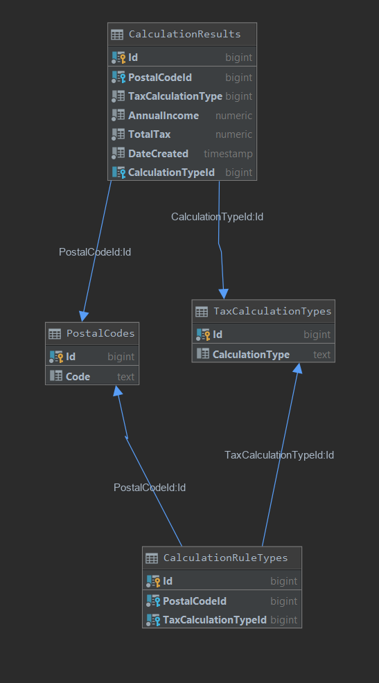

[](http://hits.dwyl.com/ArmandJ77/https://githubcom/ArmandJ77/Not-Tax-Tim)
[](https://opensource.org/licenses/MIT)


# Not-Tax-Tim
Create a small full stack solution to do tax calculations using .NET Core using MVC Razor and doing some basic CRUD operation.

## Tech Stack

- Dotnet Core 3.1
- C# 8.0
- Postgres
- Blazor
- EF Core
- Docker

## Design

- MediatR
- Nunit
- Onion Architecture
- Newtonsoft.Json

## Setup

Docker:
1. Ensure your docker is up and running.
2. Run your choice of command line interface then cd into the Not-Tax-Tim directory and run the following command
3. run the command below to start the postgres db instance

```

docker-compose up -d 

```

Database:
1. Ensure your docker container is running by following the steps above
2. open up command tool of choice and point to the Not-Tax-Tim directory 
3. Run command below to run migrations and seed the DB:

```

dotnet ef database update -c NotTaxTimDbContext -p DATABASE/NotTaxTim.Database.csproj -s API/NotTaxTim.Api.csproj

```

Run the application:
1. Ensure that both steps above have been completed
2. Ensure that multi project setup is selceted for both the NotTaxTim.Api and UI projects


Run Integration Tests:

Integration tests are setup to mock REST Cals via the API.

1. Ensure docker and migrations is up and running
2. Execute the following command while while in the Not-Tax-Tim Directory

```

dotnet test

```

## Calculations

Each postal code is linked to a type of Tax calculation:

| Postal Code   | Tax Calculation Type 
| ------------- |:--------------------:|
| 7441          | Progressive          |
| A100          | Flat Value           |
| 7000          | Flat Rate            |
| 1000          | Progressive          |

The progressive tax is calculated based on this table :
| Rate        | From         | To
| ------------| -------------|:--------------------:|
| 10          | 0            | 8350
| 15          | 8351         | 33950
| 25          | 33951        | 82250
| 28          | 82251        | 171550
| 33          | 171551       | 372950
| 35          | 372951       | -

The flat value:

· 10000 per year

· Else if the individual earns less than 200000 per year the tax will be at 5%

The flat rate:

· All users pay 17.5% tax on their income

## Database Design




## FAQ:

Why not use MSSQL?
- I simply don't have an MSSQL visualization tool on my local and given the time contraint had to get a working mvp out asap. Also    Postgres and MSSql adhere to the SQL spec with some syntax diffirences here and there whihc are out of scope for this project. The underlying database technology can easily be replacesd bu updating the nuget packages using an mssql docker image.


Why use docker?
- So that i can guarentee the same dev experience on other machines, spinning up the docker container is straight forward and handles getting the DB up and running minus migrations of course.

Why use Blazor and not normal ASP.MVC?
- It codes faster and uses latest technology, feels a lot like react but with C# instead of javascript.
